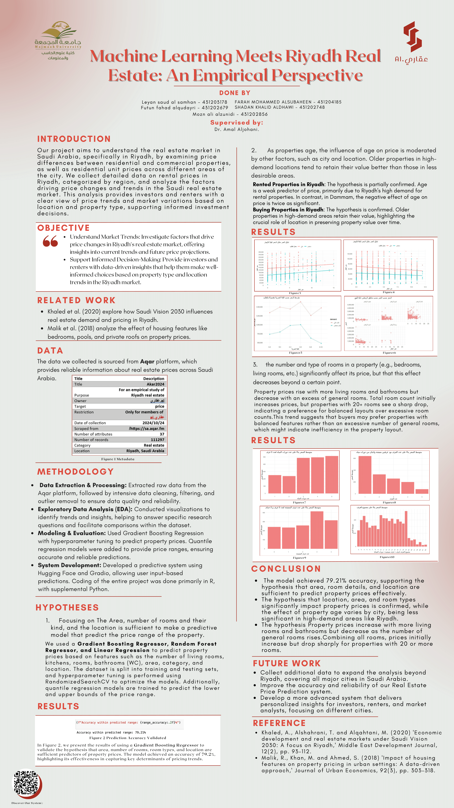

# Aqari.ai  
### Machine Learning Meets Riyadh Real Estate  
**An Empirical Perspective**

  

  <em>Click the poster to view the full code (PDF)</em>

---

## 📌 Project Overview

**Aqari.ai** is a machine learning–driven research project that analyzes and predicts **real estate prices in the Riyadh market** using real-world property data.

The project leverages **empirical data collected programmatically** from the official **Aqar platform**, followed by rigorous preprocessing, feature engineering, and regression-based modeling. The goal is to provide accurate property price estimation and meaningful insights into market dynamics across Riyadh.

---

## 🧠 Methodology

### 1️⃣ Data Acquisition
- Programmatic data collection using **Python**
- Web scraping via `requests`
- Integration with the **Aqar platform API**

### 2️⃣ Data Preprocessing
- Handling missing and inconsistent values
- Outlier detection and removal
- Feature engineering to enhance predictive power

### 3️⃣ Predictive Modeling
Multiple machine learning models were implemented and compared:

- **Gradient Boosting Regression**
- **Random Forest Regression**
- **Quantile Regression**

Models estimate property prices based on:
- Property area
- Number of rooms
- Room type
- Property type

### 4️⃣ Deployment & Interaction
- A user-friendly web interface was built for **real-time price prediction**
- Deployed using **Gradio** and **Hugging Face Spaces**

### 5️⃣ Exploratory Data Analysis & Visualization
To complement the ML pipeline, additional analysis was conducted in **R**:
- Interactive price distribution plots
- Geographic visualizations using maps
- Market trend exploration across Riyadh districts

---

## 🛠️ Tools & Technologies

### 🔹 Data Acquisition
- Python (`requests`)
- Aqar API
- Web scraping

### 🔹 Machine Learning
- Scikit-learn  
  - Gradient Boosting  
  - Random Forest  
  - Quantile Regression  

### 🔹 Visualization & Analysis
- R  
  - `ggplot2`  
  - `Leaflet`  
  - `Shiny`

### 🔹 Deployment
- Gradio
- Hugging Face Spaces

### 🔹 Supporting Techniques
- Data cleaning
- Outlier detection
- Feature engineering

---

## 🌐 Live Demo

👉 **Hugging Face Space:**  
https://huggingface.co/spaces/futun/saudiaqar

The interface allows users to input property features and receive **instant price predictions** generated by the trained models.

---

## 📄 Full Technical Report

The complete technical document includes:
- Dataset description
- Preprocessing steps
- Model design and evaluation
- Experimental results
- Visual analytics

📘 **[Download Full Project code (PDF)](aqari.pdf)**

---

## 📜 License

⚠️ **Proprietary – All Rights Reserved**

This project is **not open source**.  
No permission is granted to use, copy, modify, distribute, or reuse this code, its architecture, or its ideas without **explicit written consent** from the author.

---

  <strong>Aqari.ai — Data-driven insights for Riyadh’s real estate market</strong>

